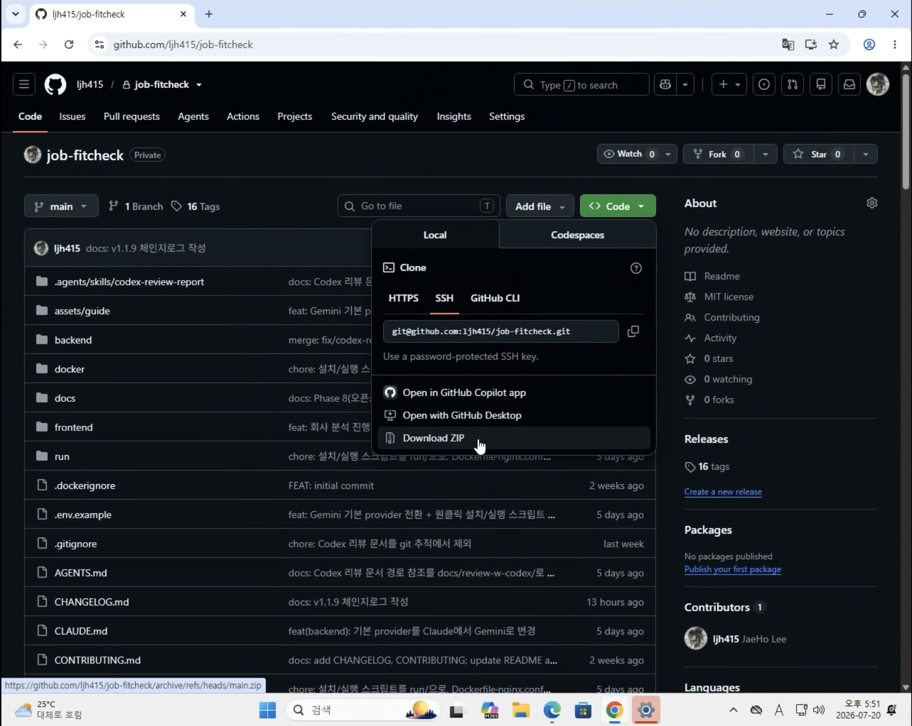
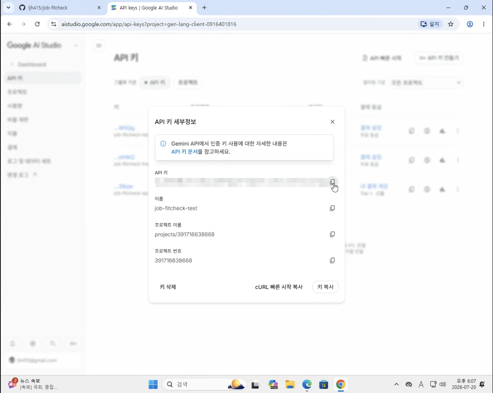
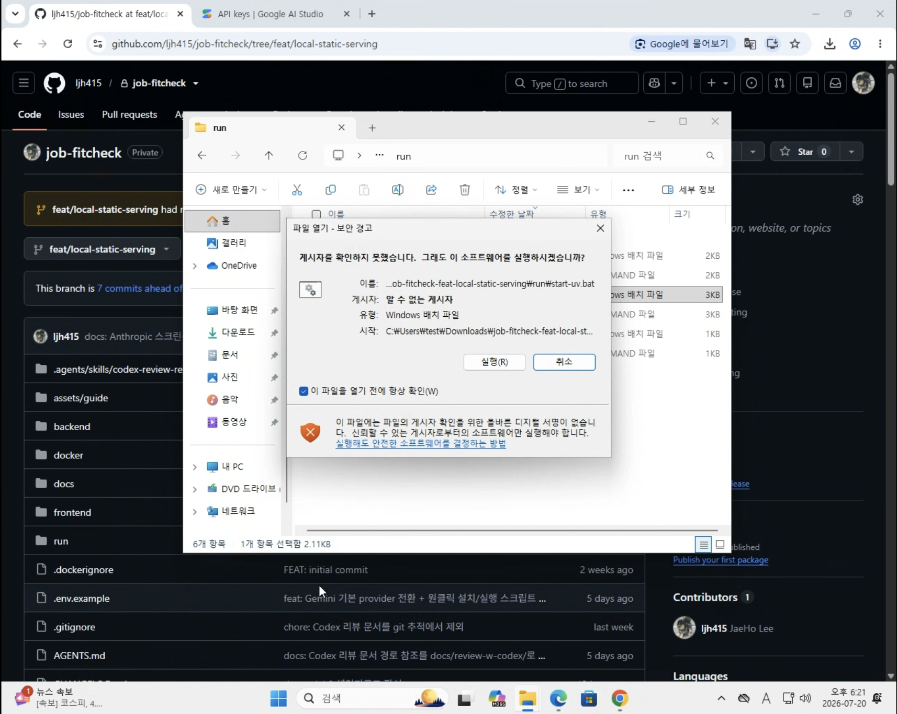
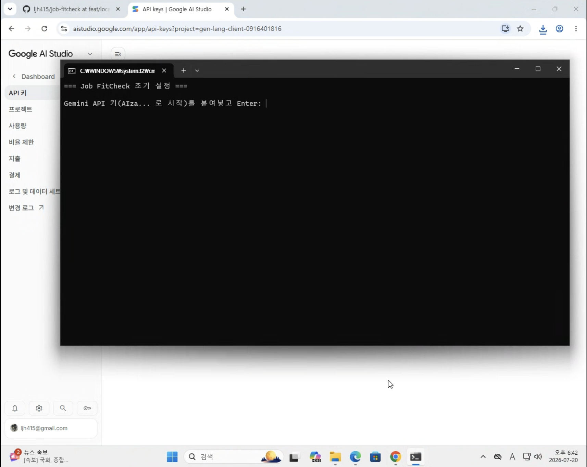
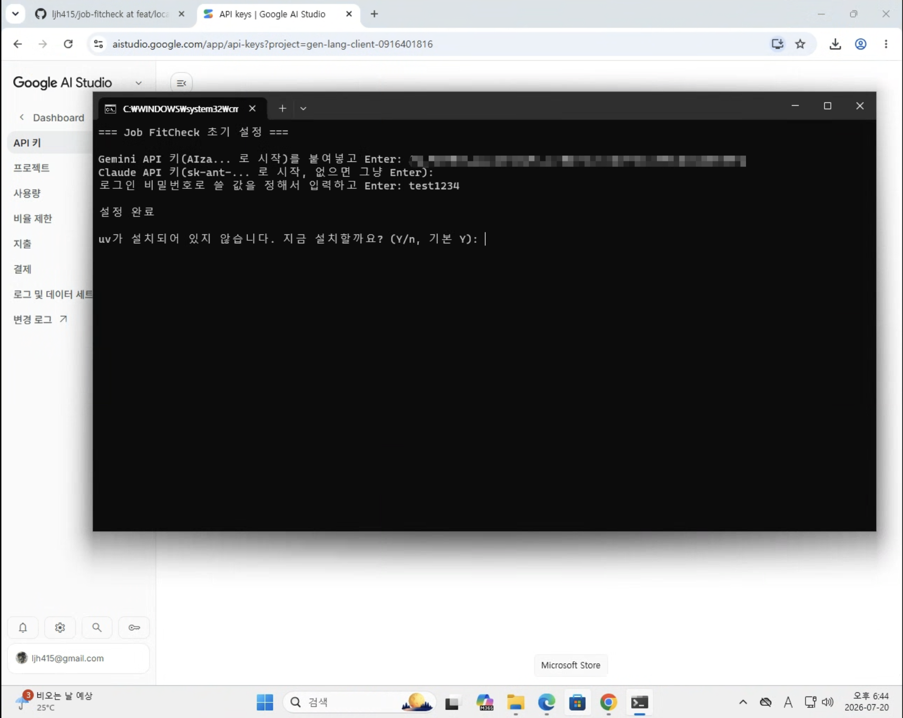
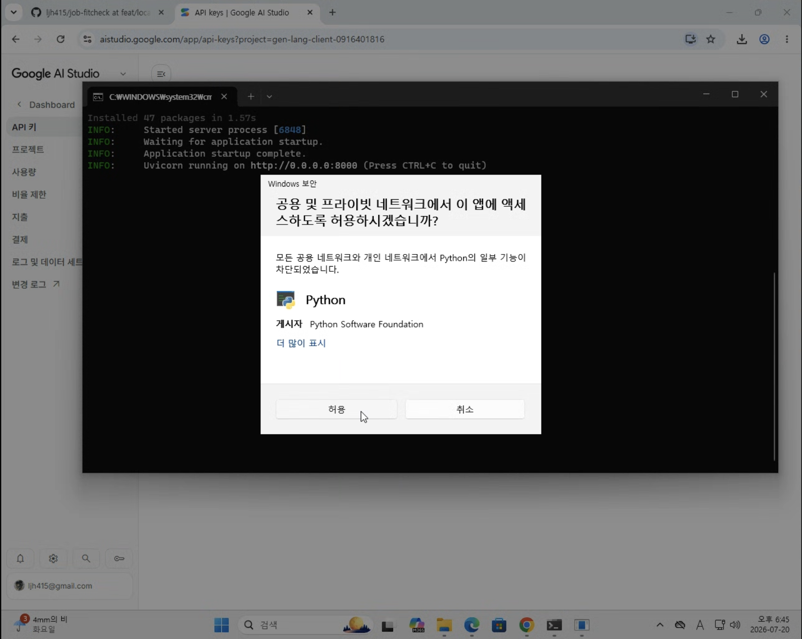
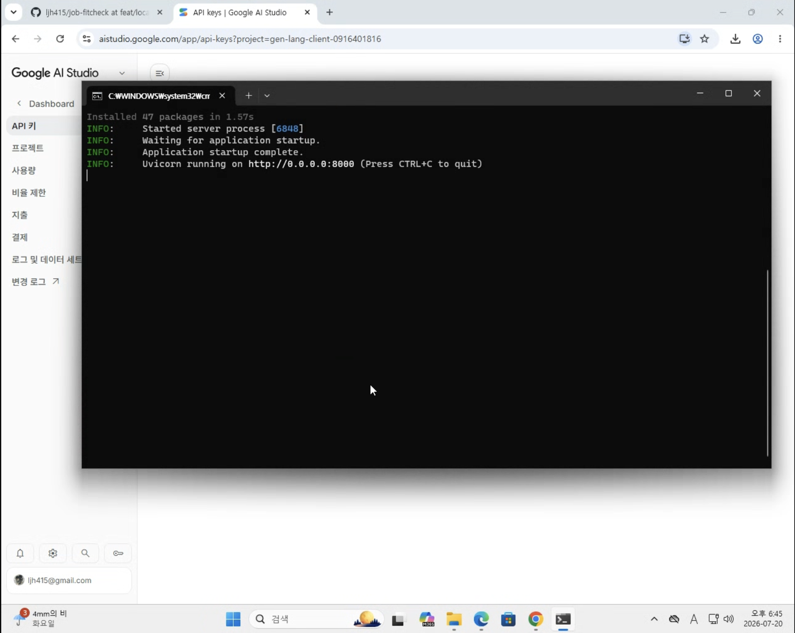
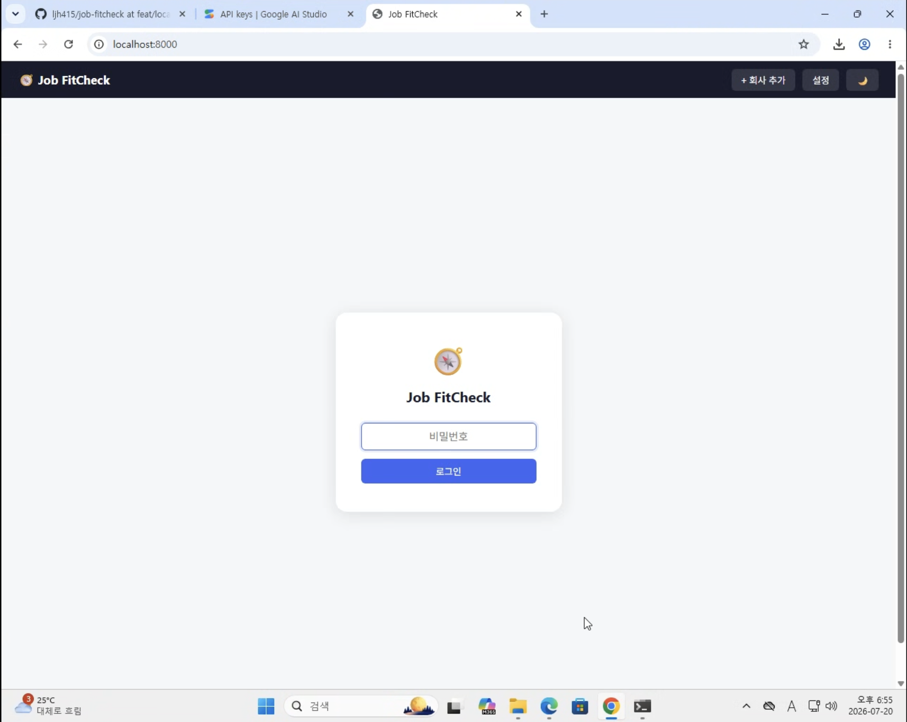
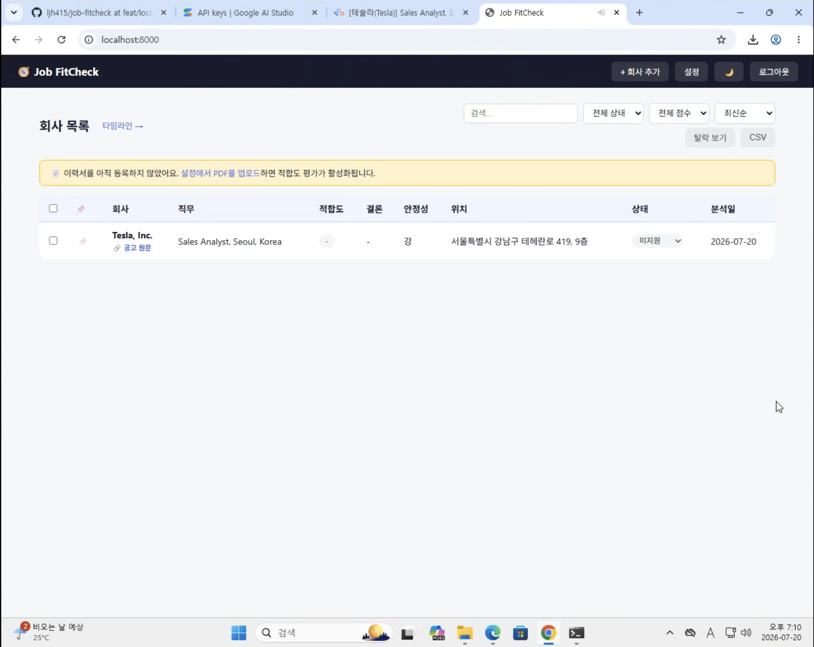

# 처음 시작하기 (완전 초보자용 가이드)

프로그래밍을 몰라도 따라 할 수 있도록 순서대로 설명합니다. 총 10분 정도 걸립니다.

컴퓨터를 새로 사거나 재설정할 일은 없습니다. `uv`라는 아주 가벼운 도구 하나만 필요한데, 이것도 별도로 미리 설치할 필요 없이 아래 과정 중에 자동으로 설치됩니다.

<!-- 스크린샷은 assets/guide/에 이미 반영되어 있습니다. 참고용 목록: -->
> **📸 스크린샷 목록** (`assets/guide/`)
> - `01-github-download-zip.png`, `02-gemini-api-key.png` — 1~2단계
> - `03-start-uv-prompt.png`, `03-start-uv-success.png` — 3단계 실행 과정
> - `windows-security-warning.png`, `windows-uv-install-prompt.png`, `windows-firewall-warning.png` — Windows에서만 뜨는 창들
> - `04-login-screen.png`, `05-dashboard-result.png` — 4~5단계
>
> (Claude API 키 발급 화면은 선택 사항이라 생략했습니다. 결제 정보가 나올 수 있어 캡처를 권장하지 않습니다.)

---

## 1단계. 프로젝트 다운로드

GitHub 저장소 페이지에서:

1. 초록색 **`Code`** 버튼 클릭
2. **`Download ZIP`** 클릭

   

3. 다운로드된 zip 파일의 압축을 풀기 (더블클릭하면 자동으로 풀리는 경우가 많습니다)
4. 압축 푼 폴더를 원하는 위치(예: 바탕화면)로 옮겨두기

> `git`을 이미 써보셨다면 `git clone` 명령어로 받으셔도 됩니다. 모르면 위 방법으로 충분합니다.

---

## 2단계. AI API 키 발급받기

이 앱은 AI로 채용공고를 분석합니다. 기본값은 **Google Gemini**로 설정돼 있는데, 무료로 바로 발급받아 쓸 수 있어서 처음 시작할 때 제일 간편합니다.

### Gemini API 키 발급 (기본, 무료)

1. [https://aistudio.google.com/apikey](https://aistudio.google.com/apikey) 접속 → 구글 계정으로 로그인
2. **Create API Key** 클릭
3. 생성된 키(`AIza`로 시작하는 문자열)를 복사

   

> 무료 티어는 모델당 하루 20회 호출 제한이 있습니다(README의 "Gemini 무료 티어" 참고). 가볍게 체험만 해보실 거면 이 키 하나로 충분하니 3단계로 넘어가셔도 됩니다.

### (추천) Claude API 키도 함께 준비하기

Gemini보다 분석 품질이 더 정확한 편입니다. 나중에 설정 화면에서 Gemini → Claude로 언제든 전환할 수 있으니, 여유가 되면 같이 발급받아두는 걸 추천합니다. 사용한 만큼 비용이 청구됩니다 (공고 1건 분석에 대략 **$0.1 내외** — [README의 사용 비용 추정치](README.md#사용-비용-추정치) 참고).

1. [https://console.anthropic.com](https://console.anthropic.com) 접속 후 회원가입/로그인
2. 왼쪽 메뉴에서 **Billing**(결제) 들어가서 결제 수단(카드) 등록 및 최소 금액 충전 (보통 $5부터 가능)
3. 왼쪽 메뉴에서 **API Keys** 클릭 → **Create Key** 클릭
4. 생성된 키(`sk-ant-`로 시작하는 긴 문자열)를 복사 — **이 화면을 벗어나면 다시 볼 수 없으니** 메모장 등에 잠깐 붙여두세요

---

## 3단계. 앱 실행

1단계에서 압축을 푼 폴더를 열어보면 `run` 폴더가 있습니다. 그 안의 **`start-uv.command`(Mac)** 또는 **`start-uv.bat`(Windows)** 를 **더블클릭**하세요.

> **Windows에서 "게시자를 확인하지 못했습니다"라는 보안 경고가 뜨면?** 서명이 없는 일반 스크립트라 뜨는 정상적인 경고입니다. **"실행"** 을 누르면 됩니다.
>
> 

처음 실행하는 거라면 검은 화면(터미널)이 뜨면서 순서대로 물어봅니다.
- **Gemini API 키**: 2단계에서 복사해둔 키를 붙여넣고 Enter
- **Claude API 키**: 준비했다면 붙여넣고 Enter, 없으면 그냥 Enter(비워두고 넘어가기)
- **로그인 비밀번호**: 원하는 값을 입력하고 Enter

  

이어서 `uv`가 컴퓨터에 없으면 "지금 설치할까요? (Y/n)"라고 물어봅니다 — 그냥 **Enter**만 누르면 자동으로 설치되고 곧바로 실행까지 이어집니다.

  

처음 실행할 때는 필요한 프로그램(Python)과 패키지를 받느라 수 초~1분 정도 걸릴 수 있습니다. 그 이후로는 훨씬 빠릅니다.

> **Windows에서 "공용 및 프라이빗 네트워크에서 이 앱에 액세스하도록 허용하시겠습니까?"라는 방화벽 창이 뜨면?** 서버가 이 컴퓨터 안에서 통신하도록 허용하는 정상적인 창입니다. **"허용"** 을 누르면 됩니다.
>
> 

검은 화면에 로그가 흐르다가 `Uvicorn running on...` 같은 문구가 보이면 준비된 겁니다.

  

> **이 창은 닫지 말고 그대로 켜두세요** — 창을 닫으면 앱도 같이 꺼집니다.

> **Mac에서 "확인되지 않은 개발자" 경고가 뜨면?** 파일을 마우스 오른쪽 클릭 → "열기" 선택 → 다시 한번 "열기"를 누르면 실행됩니다 (한 번만 해주면 됩니다).

> ### 💡 대신 Docker로 실행하고 싶다면 (선택)
>
> 여러 앱이 완전히 격리된 환경에서 도는 걸 선호하거나, 이미 Docker를 쓰고 있다면 Docker로 실행할 수도 있습니다. 다만 Docker Desktop은 용량이 크고(수백MB) 설치 중 재시작이 필요할 수 있어(특히 Windows), 위 uv 방식보다 준비 과정이 더 오래 걸립니다.
>
> 1. [Docker Desktop](https://www.docker.com/products/docker-desktop/)을 다운로드해 설치하고 실행 → 창에 **"Engine running"** 문구가 보이면 준비 완료
> 2. 1~2단계(다운로드·API 키)는 위와 동일하게 진행
> 3. 3단계에서만 `start-uv.command`/`.bat` 대신 **`run/start-docker.command`(Mac)** 또는 **`run/start-docker.bat`(Windows)** 를 더블클릭 — API 키/비밀번호 질문은 동일하게 뜨고, 그 다음 Docker로 실행됩니다
> 4. 끌 때는 `run/stop-docker.command`/`stop-docker.bat`을 더블클릭 (uv 방식과 달리 창을 닫는 것만으론 완전히 꺼지지 않을 수 있습니다)
>
> ⚠️ Docker 방식과 uv 방식은 같은 포트(8000)를 씁니다. 동시에 켜두지 말고 한 가지 방식만 선택해서 쓰세요.

> ### 🤖 RAG 채팅까지 쓰고 싶다면 (선택, Docker 방식 전용)
>
> 등록한 공고 전체를 근거로 자연어로 질문하는 채팅 기능입니다. Postgres가 추가로 필요해 Docker 방식에서만 켤 수 있고, 기본은 꺼져 있습니다. 켜는 법은 **[RAG_GUIDE.md](RAG_GUIDE.md)** 참고.

---

## 4단계. 접속 및 로그인

1. 브라우저(크롬 등)를 열고 주소창에 `http://localhost:8000` 입력
2. 3단계에서 정한 비밀번호 입력 → 로그인

   

---

## 5단계. 첫 사용

1. (선택) **설정** 탭 → 이력서/포트폴리오 PDF 업로드 → 프로필 자동 생성 — 이 단계는 건너뛰어도 됩니다. 이력서 없이 채용공고 정보만 정리해서 모아두는 "아카이빙" 용도로도 쓸 수 있고, 나중에 언제든 업로드해서 적합도 평가를 켤 수 있습니다
2. **+ 회사 추가** → 채용공고 URL 붙여넣기 또는 텍스트/이미지 입력 → AI 분석 (이력서를 등록했다면 적합도 평가까지 자동으로 진행됩니다)
3. **대시보드**에서 결과 확인, Q&A로 질문도 가능

   

---

## 앱을 끄고/다시 켜고 싶을 때

- **끄기**: 3단계에서 실행해둔 터미널 창에서 `Control + C`를 누르거나, 창을 그냥 닫기
- **다시 켜기**: `run` 폴더의 `start-uv.command`/`start-uv.bat`을 다시 더블클릭 (설정 파일과 데이터는 그대로 남아있어서 키/비밀번호를 다시 묻지 않습니다)

> Docker로 실행하셨다면: `stop-docker.command`/`stop-docker.bat`으로 끄고, `start-docker.command`/`start-docker.bat`으로 다시 켜세요.

---

## 터미널로 직접 하고 싶다면 (선택)

스크립트 없이 터미널 명령어로 직접 하고 싶은 분들을 위한 방법입니다. 위 3단계 대신 아래 순서를 따르면 됩니다.

1. 터미널 열기
   - Mac: `Command(⌘) + Space` → "터미널" 입력 → Enter
   - Windows: 시작 메뉴 → "PowerShell" 검색 → Enter
2. 1단계에서 압축을 푼 폴더로 이동 — 터미널에 `cd ` 라고 입력(마지막에 띄어쓰기 한 칸)한 뒤, 폴더를 마우스로 끌어서 터미널 창 위에 놓으면 경로가 자동으로 채워집니다 → Enter
3. 설정 파일 만들기: `cp .env.example .env` 입력 후 Enter
4. 파일 열어서 값 채우기
   - Mac: `open -e .env`
   - Windows: `notepad .env`

   입력 후, 열린 파일에서 `GOOGLE_API_KEY=`와 `APP_SECRET=` 뒤에 값을 채우고(Claude 키가 있으면 `ANTHROPIC_API_KEY=`도) 저장
5. `uv`가 없다면 설치: `curl -LsSf https://astral.sh/uv/install.sh | sh` (Windows는 `powershell -ExecutionPolicy ByPass -c "irm https://astral.sh/uv/install.ps1 | iex"`)
6. 실행: `uv run --python 3.12 --with-requirements backend/requirements.txt backend/main.py` 입력 후 Enter
7. 끄기: 같은 창에서 `Control + C`

> Docker로 직접 하고 싶다면 5~6번 대신 `docker compose up --build`를, 끌 때는 `docker compose down`을 쓰면 됩니다.

---

## 문제가 생겼을 때

| 증상 | 원인/해결 |
|---|---|
| `uv: command not found` 같은 오류 | `start-uv.command`/`.bat` 실행 시 설치 질문에 답하지 않았거나 설치가 안 된 상태입니다. 스크립트를 다시 실행해 설치 질문에 Enter(또는 Y)로 답해주세요 |
| 포트가 이미 사용 중이라는 오류(`address already in use`) | 8000번 포트를 다른 프로그램(다른 로컬 서버 등)이 쓰고 있습니다. 그 프로그램을 끄거나 컴퓨터를 재시작한 뒤 다시 시도해주세요 |
| 로그인이 안 됨 | 3단계에서 정한 비밀번호를 정확히 입력했는지 확인 (대소문자 구분, 키보드 한/영 전환 상태도 확인 — 한글 입력 모드에서 영문 비밀번호를 치면 다른 문자로 입력됩니다) |
| 공고 분석 시 "인증" 관련 오류 | API 키가 정확히 입력됐는지 확인 — 다시 설정하려면 `.env` 파일을 지우고 `start-uv.command`/`.bat`을 다시 실행하면 처음처럼 다시 물어봅니다 |
| (Docker로 실행하는 경우) `docker: command not found` | Docker Desktop이 실행 중이 아닙니다. 아이콘을 찾아 실행한 뒤 다시 시도 |
| (Docker로 실행하는 경우) `port is already allocated` | 압축 푼 폴더의 `docker-compose.yml` 파일을 텍스트 편집기로 열어 `"8000:80"` 부분을 `"8080:80"`처럼 다른 숫자로 바꾸고 저장 → 다시 실행 → 브라우저 주소도 바꾼 숫자로(`http://localhost:8080`) 접속 |
| 그 외 궁금한 점 | [README.md](README.md)에 기능별 설명이 더 자세히 있습니다 |
